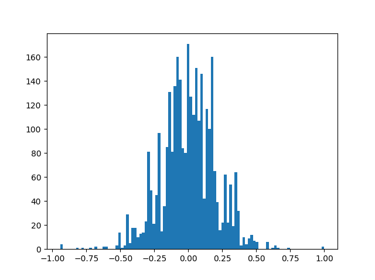
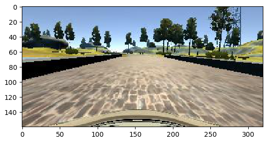
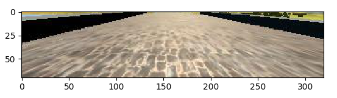

# Behavioral Cloning

## Behavioral Cloning Project

The goals of this project are the following:

- Use the video game like simulator to collect data of good driving behavior by driving car in track-1
- Build, a Deep neural network in Keras that predicts steering angles from image frame coming from simulator
- Train and validate the model with a training and validation set
- Test that the model successfully drives around track-1 without leaving the road
- Summarize the results with a written report

## Solution Design Approach

## 1. Balancing Dataset:

- I have used the sample data provides by Udacity as I was not able to properly record good driving behavior on my system.

- The dataset was having most of the data point around steering angle 0 , which was making my model to be biased driving straight and was not able to turn smoothly on curves.

- To balance out the dataset first I plot the dataset histogram to check the spread of data points and then I divided the range of steering angles into 1000 bins of step size 0.02 (model.py function: balance dataset) , I took 80 Images per bin which was defined by IMAGE_COUNT_PER_BIN=80.

- Below Image shows the Histogram of the balanced dataset X-axis shows the steering angle values and Y-axis shows the Image count for that x value

## 2. Preprocessing dataset:

- Preprocessing includes cropping the image in y-axis 65 pixels from the top and 25 pixels from bottom.

    1. Original Image

    

    2. Preprocessed Image

    

## 3. Data Augmentation:
 
    - Augmentation includes randomly choosing the camera image from center left and right camera, adding the offset to steering angle based on the image chosen, preprocessing the image which includes cropping the image to just select the drivable portion from the frame and randomly flipping the image along vertical axis and changing the sign of steering angle.
    
    - Code for which is in model.py function: augment_row
 
## 4.Training Approach:

- My model includes mix of convolutional neural network and Dense layers; I have used Adam Optimizer which chooses the learning rate automatically

- So only hyper parameters to tune were batch size, number of epochs and keep_prob values of drop out layers

- Earlier I was resizing the images while feeding it to the model, but that model was not working properly and going out of track on few spots also after few epoch validation losses stop improving but training loss was decreasing it was because of the overfitting.

- To overcome I removed resizing, tuned keep_prob and also added a checkpoint to store best weights after each epoch based on the improvement in validation loss

- Model worked well on track -1 at speed of 9mph , till 20 mph without going out of the drivable portion, recording of one lap is available in video.mp4 

# Rubric Points:

Here I will consider the rubric points individually and describe how I addressed each point in my implementation.

## Files Submitted & Code Quality:

## 1. Are all required files submitted?

- My project includes the following files:
    - model.py containing the script to create and train the model
    - drive.py for driving the car in autonomous mode
    - model.h5 containing a trained convolution neural network
    - writeup_report.pdf summarizing the results
    - video.mp4 containing recording of autonomous driving for one lap
    
## 2. Is the code functional?

- Using the simulator and my drive.py file, the car can be driven in autonomous mode by executing below mentioned code: 
        python drive.py model.h5
To

This autonomous drive can be recorded by putting a folder name to store recorder frames

    `python drive.py model.h5 <folder_name>`

video can be compiled from recorder frames by using 

    `python video.py <folder_name>`

## 3. Is the code usable and readable?

The model.py file contains the code for preprocessing dataset, training and saving the convolution neural network. The file shows the pipeline I used for training and validating the model, and it contains proper comments to explain how the code works.

# Model Architecture and Training Strategy

1. An appropriate model architecture has been employed

- My model consists of 3 convolutional neural network, 2 Max pooling layer as shown (model.py function: get_model), Each Convolution network and dense layer is followed by ELU Activation Layer

|No |Layer                  |Depth  |Filter/Pool Size   |Stride |
|---|-----------------------|-------|-------------------|:-----:|
|1  |Convolution layer 1    |32	    |5x5                |2x2    |
|2  |MaxPooling layer 1     |       |2x2                |None   |
|3  |Convolution layer 2    |16     |3x3                |1x1    |
|4  |MaxPooling layer 2     |       |2x2                |None   |
|5  |Convolution layer 3    |16	    |3x3                |1x1    |

|6  |Drop out Layer 1       |Keep_prob : 0.3    |
|7  |Flatten Layer          |                   |	
|8  |Drop out Layer 2       |Keep_prob : 0.3    |
|9  |Dense layer 1          |Size : 512         |
|10 |Dense layer 2          |Size : 256         |
|11 |Output Dense layer 3   |Size : 1           |

- The model includes ELU layers to introduce nonlinearity and the data is normalized in the model using a Keras lambda layer.
Number of parameters and input and output shape at each layer is shown below:

|Layer      | (type)    |   Output Shape    |   Param #|Connected to    |
|-----------|-----------|-------------------|:-------------------------:|
|lambda_1 (Lambda)  |(None, 70, 320, 3) |0  |lambda_input_1[0][0]
|convolution2d_1 (Convolution2D) |(None, 35, 160, 32)    |2432   |lambda_1[0][0]
|elu_1 (ELU)    |(None, 35, 160, 32)    |0  |convolution2d_1[0][0]
|maxpooling2d_1 (MaxPooling2D)  |(None, 17, 80, 32) |0  |elu_1[0][0]
|convolution2d_2 (Convolution2D)    |(None, 17, 80, 16) |4624   |maxpooling2d_1[0][0]
|elu_2 (ELU)    |(None, 17, 80, 16) |0   |convolution2d_2[0][0]
|maxpooling2d_2 (MaxPooling2D)  |(None, 8, 40, 16)  |0  |elu_2[0][0]
|convolution2d_3 (Convolution2D)    |(None, 6, 38, 16)  |2320   |maxpooling2d_2[0][0]
|elu_3 (ELU)    |(None, 6, 38, 16)  |0  |convolution2d_3[0][0]
|dropout_1 (Dropout)    |(None, 6, 38, 16)  |0  |elu_3[0][0]
|flatten_1 (Flatten)    |(None, 3648)   |0  |dropout_1[0][0]
|dense_1 (Dense)    |(None, 512)    |1868288    |flatten_1[0][0]
|elu_4 (ELU)    |(None, 512)    |0  |dense_1[0][0]
|dropout_2 (Dropout)    |(None, 512)    |0  |elu_4[0][0]
|dense_2 (Dense)    |(None, 256)    |131328 |dropout_2[0][0]
|elu_5 (ELU)    |(None, 256)    |0  |dense_2[0][0]
|dense_3 (Dense)    |(None, 1)  |257    |elu_5[0][0]

- Total params: 2,009,249
- Trainable params: 2,009,249
- Non-trainable params: 0

2. Attempts to reduce overfitting in the model

- The model contains 2 dropout layers in order to reduce overfitting (model.py function: get_model).

- The model was trained and validated on different data sets to ensure that the model was not overfitting (model.py function: train_model).The model was tested by running it through the simulator and ensuring that the vehicle could stay on the track.

3. Model parameter tuning
- The model used an Adam optimizer, so the learning rate was chosen automatically (model.py function: get_model).

4. Appropriate training data
- Training data was chosen to keep the vehicle driving on the road. I used a combination of center lane driving, images from left and right camera were chosen randomly and appropriate correction were applied to steering angle which helps model to learn recovery in case car getting out of track.
For details about how I created the training data, see the next section.