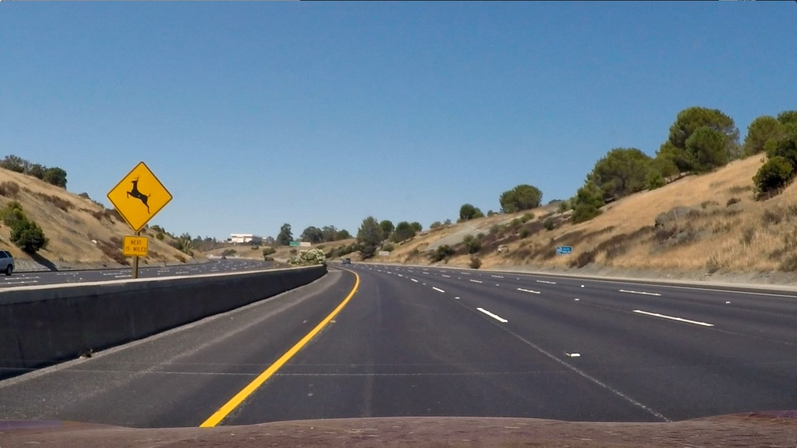

## Advanced Lane Finding

In this project, your goal is to write a software pipeline to identify the lane boundaries in a video, but the main output or product we want you to create is a detailed writeup of the project.  Check out the [writeup template](https://github.com/udacity/CarND-Advanced-Lane-Lines/blob/master/writeup_template.md) for this project and use it as a starting point for creating your own writeup.  

The Project
---

The goals / steps of this project are:

1) Perform a camera calibration.
2) Apply a distortion correction to raw images.
3) Do color transforms and  gradients to create a thresholded binary image.
4) Perform perspective transform.
5) Detect lane pixels using hist.
6) Finding the curvature of the road.
7) Display green color in lane lines in original image.

The output after performing each steps can be found in below mentioned videos:

1) 

2) 

3) 

# 1) Perform a camera calibration:

Camera calibration was done using chess board images taken from same camera and were kept in camera_cal folder.
Test images contains 9x6 corners in horizontal and vertical directoins respecively. Image and Object points lists were passed to 
cv2.calibrateCamera function to get distortion coefficient and camera calibration. Based on these coefficients images were undistorted using $ cv2.undistort() $ method.

# 2) Apply a distortion correction to raw images:

Undistorted images and their original one are displayed below:

          
          
          
          
          
          

    

# 3) Do color transforms and  gradients to create a thresholded binary image:

Thresholding task was used to find edges in the images.The thresholding was done on the S-channel image in HLS colorspace.S-channel thresholdig gives better result compare to H and L channel thresholding. In the quiz section of course it was already tested so I directly used S-channel thresholding and achieved good edge detection.

# Discussion
---
My code still not performing well on challenging videos. I tried playing with parameters/thresholds but still it is not efficient. Also more computation we are using is introducing more leg in outcome and in real time car will have to do many other tasks so need to think in direction of optimazation.

To improve my result, 

I can utilize more from previous frames and can reduce probable area in which future lane lines can be.

