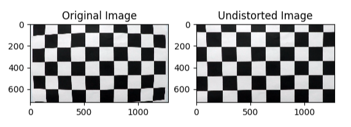
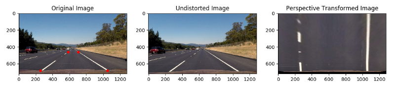
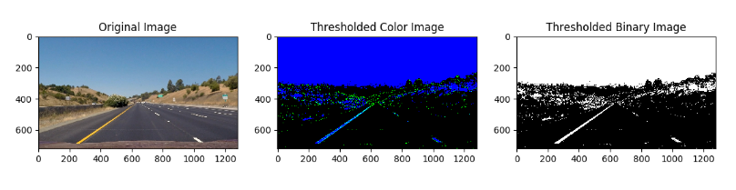
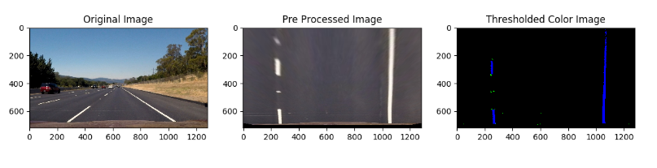
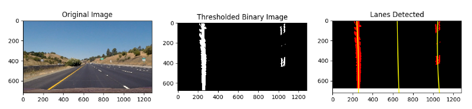

## Advanced Lane Line Finding

The goals / steps of this project are:
1) Perform a camera calibration.
2) Apply a distortion correction to raw images.
3) Do color transforms and  gradients to create a thresholded binary image.
4) Perform perspective transform.
5) Detect lane pixels using hist.
6) Finding the curvature of the road.
7) Display green color in lane lines in original image.

The output after performing each steps can be found in below mentioned video:

In order to acheive above output, following steps were performed:

# 1) A camera calibration:

Code for this step is contained in src/preprocessing.py : calibrate_camera()

I started by initializing obj_points which are the 3D world co-ordinates for the chessboard corners it will have (x,y,z) values were z=0 as all the corner points lies on the same flat chessboard plane. This will be appended to obj_points_list after each successful detection of chessboard corners. I have used cv2.findChessboardCorners to find NX*NY chess board corners NX is the number of corners in x-direction, NY is the number of corners in y-direction NX=9 and NY=6 for given chessboard images.

If corners are successfully detected then I am appending the co-ordinates of these corners img_points to img_points_list . 
These lists are used by cv2.calibrateCamera to fetch camera matrix and distortion co-efficient , I am storing this data to a pickle file. Next call to calibrate_camera will load this matrix and co-efficient from pickle file directly and skips the calculations.

# 2) Apply a distortion correction to raw images:

Code for this step is contained in src/preprocessing.py : undist_image()
I used camera matrix and distortion co-efficient to undistort all the raw camera image, I have used cv2.undist function for the same. Obtained results can be seen in below images

    
# 3) Perspective Transformation:

Code for this step is contained in src/preprocessing.py : perspective_transform (), get_perspective_transform_matrix()
Perspective transformation has been used to the perspective of camera to bird eye view so the road and lane lines can be seen from the top and measurement of the curvature and vehicle position can be determined.

Perspective transformation matrix has been derived from below source points from the original test image and their corresponding destination points in the transformed image. These points has been chosen from the test images having straight lane lines.

| Source Points | Destination Points| 
| ------------- |:-----------------:|
| (257, 685)    | (257, 685)        |
| (1050, 685)   | (1050, 685)       |
| (583, 460)    | (257, 0)          |
| (702, 460)    | (1050, 0)         |

cv2.getPerspectiveTransform  is being used to get the transformation matrix and the inverse transformation matrix , cv2.warpPerspective is used to transform the raw images, Results of the transformation can be seen from below images.

Red points in the original image represents the chosen source points, last image shows the bird eye view of the road. Where the distance between 2 lane lines is 794 pixels. This has been used to get meters per pixel for x-direction i.e. XM_PER_PIX where actual distance between lanes is considered 3.7m.

Below image shows the results on curvy lane lines near the left turn:

# 4) Lane lines Detection:

For detecting the lane lines from the perspective transformed image I have used different thresholding techniques on colour channels and on gradient image which are described below

# Thresholding :

Code for this step is contained in src/thresholding.py 

   1.Colour Thresholding :

   Lane lines are of white or yellow colour,to detect the lane lines in different weather,lighting conditions, I have used filtering on    HSL Colour space where I am using thresholding on saturation and hue channels,thresholds have been tuned to detect lane lines only

   2.Gradient Thresholding :

   Lane lines are having edge on both the side and this can be detected using edge detectors like canny and sobel,I have sobel edge        detection with gradient in x, y direction, magnitude and direction of threshold. This 4 result have been combined to detect edge of      the lane line

These both thresholding have been combined to form the final binary image showing the lane lines.Results can be seen from the below images: 

# Sliding Window Search

Code of this section is contained in slidingwindowsearch.py

This technique has been used to identify lane line pixels and fitting 2 curves for left and right lane lines, search_lanes() method of LaneDetector Class implements this logic. Where in the first pass a sliding window search start from the bottom of the image and identifies pixels of the lane portion and continue towards top of the image, then this pixels are fitted by 2nd degree polynomial.

In the above image left line pixels are marked with Red colour, and right lane pixels are marked with blue colour, green rectangles shows the window used for detection. Fit curves are marked with yellow lines.

Here in the above image there are 3 fit, 1st  and 3rd are left and right lane ,mid curve is used to calculate the vehicle position and radius of curvature.
Final output image and video overlays the lane portion in green, radius of curvature and vehicle position from the left lane assuming lanes are 3.7m wide and road length shown in video is approximately 30m

# Test on images:

Final output image will overlay lane portion in green, Radius of curvature and position from the centre which is in range of (-0.5 ,0.5). overlay is done on the undistorted image. Below images shows the final result on a sample test image.

# Test on video

Code for Video pipeline is in runner.py which converts the videos to frame, process each frame and then compiles the output video.
Sample output video can be found with name: output.mp4 and also on youtube: http://www.youtube.com/watch?v=1Ojmk2t7rGU

## Discussion 
   * Problems faced during Tuning Threshold Parameters:
        - Tuning parameters for thresholding was tricky and I found it time consuming, to make this faster I have used sliders from               OpenCV and made a function to tune parameter for every threshold function individually. And then combined the result of all             the thresholds. Code for the same is available in thresholding.py Threshold_Tuner Class. Which saved lot of time.

   * Problem in detecting lines with shadows:
        - I was facing a problem to identify lane lines with shadows as I was using gradient and Saturation channel thresholding. It was           detecting shadows as a lane line, to fix this I have added more thresholding function on X and Y gradient, direction and                 magnitude of gradient and most important Thresholding on Hue channel, Combinations of all this resulted in a robust pipeline.  
   * Possible failures:
        - My pipeline for detecting lane lines is not fully robust so it can fail at some places of challenge video. Few bad frames can           make lane detection to fail as I am not using reset functionality.
        - My pipeline might also fail in different weather condition or on road with patches.
