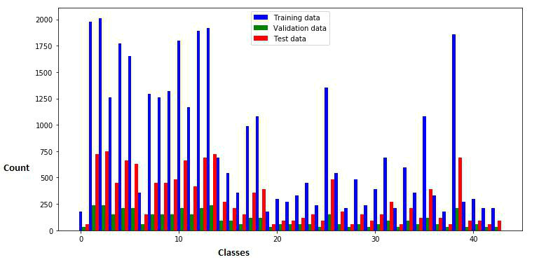
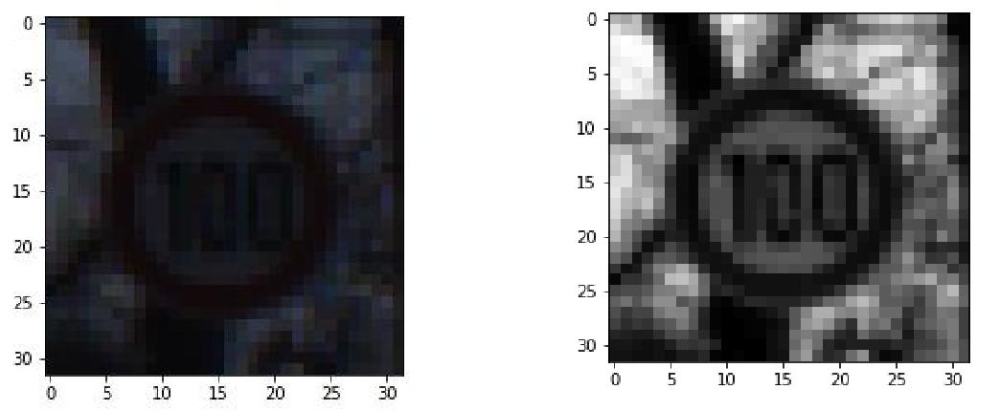
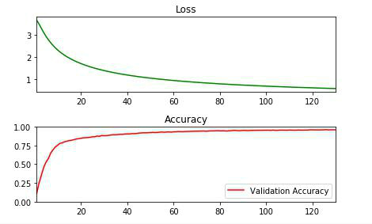
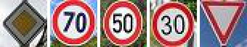

# Traffic Sign Classifier Project

In this project, I have used what I’ve learned about deep neural networks to classify traffic signs. Specifically, I have trained a model to classify traffic signs from the German Traffic Sign Dataset.

The goals / steps of this project are the following:

    - Loading the data set
    - Exploring, summarizing and visualizing the data set
    - Designing, training and testing a model architecture
    - Using the model to make predictions on new images
    - Analyzing the Softmax probabilities/output certainties over the new images

# Rubric Points
Here is my explanation to rubric cube points.

## 1.  Dataset Exploration

    1.1 Dataset Summary :

    I have written a code to calculate statistical summary of the dataset like the size of training, validation and test dataset, shape of the traffic sign images in dataset, number of unique classes/labels in dataset. Statistics for the given dataset are as follows:

        Number of training examples = 34799
        Number of testing examples = 12630
        Image data shape = (32, 32, 3)
        Dataset Shape = (34799, 32, 32, 3)
        Number of classes = 43

    1.2 Exploratory Visualization :
    
    Bar chart of exploratory visualization is as shown below
    

## 2.  Design and Test a Model Architecture

    2.1 Pre-processing :
        Pre-processing pipeline consist of below mentioned steps:

        1.Converting an Image into Greyscale

            This reduce the channel of image to 1, which helps to train our network faster, we also do not require images to be in colour as mostly Image is can be identified with their pattern instead of the colour

        2.Applying Histogram Equalization

            Images provided in the dataset are not taken in same brightness/lightning condition, some of them are bright and some of them are too dark, to equalize the brightness before processing images I have applied Histogram Equalization on the images, I have used open cv library.

        3.Normalization of the image pixels

            Normalization is applied to make the mean zero and equal variance

    Here is an example of an Image before (a) and after (b) applying pre-processing
    

    2.2 Model Architecture:

        My final model consisted of the following layers:

        | Layer             | Description                                       |
        | ------------------|:-------------------------------------------------:|
        | Input             | 32x32x1 Gray Scale image                          |
        | Convolution 5x5   | 1x1 stride, valid padding, outputs 28x28x6        |
        | Max pooling       | 2x2 kernel, 1x1 stride, outputs 14x14x6           |
        | Convolution 5x5   | 1x1 stride, valid padding, outputs 10x10x16       |
        | Max pooling	    | 2x2 kernel, 1x1 stride, outputs 14x14x6		    |
        | Fully connected   | 400x120 filter , outputs 120	                    |
        | RELU	            | Activation Function                               |
        | Drop Out	        | With keep_prob =0.4                               |
        | Fully connected	| 120x84 filter , outputs 84                        |
        | RELU	            | Activation Function                               |
        | Drop Out	        | With keep_prob =0.6                               |
        | Fully connected	| 84x43 filter , outputs 43                         |
        | Softmax	        | Classifier Activation Function                    |
		
    2.3 Model Training:

        To Train the Model I used the Adam Optimizer from tensorflow.
        I have tuned the parameters to following values:

            BATCH_SIZE = 128
            EPOCHS = 130
            LEARNING_RATE = 0.0001

    2.4 Solution Approach:

        For choosing Hyper Parameter I have first run less epochs with coarse tuning for learning rate , I have plotted Validation Accuracy and Training Loss Curve and based on that I have fine tuned all the parameters.

        After Epoch 130 My model is converging around 95.6% Validation Accuracy Below Graphs shows Training Loss and Validation Accuracy at each epoch

        

        I have used Model similar to Lenet Architecture, I was getting saturation on validation accuracy and was getting over fitting, to reduce over fitting I have applied dropout at final 2 fully connected layers of the model with keep_prob of 0.4 and 0.6 respectively while training the model.

        Convolution Layers at first 2 layers help to reduce the dimension of output and also add spatial meaning to the data, Max Pooling helps to subsample the output after convolution layer which further reduce the output size, final fully connected layers extract the meaning of features detected by convolution layers earlier and classify the images accordingly

    ## My Final Model results are:

        Validation Accuracy: ~ 95.6%
        Test Accuracy: ~ 93.23%

## 3. Test a Model on New Images

    3.1 Acquiring New Images:

        I have 5 new German traffic sign images from the web same are shown below, cropped them to just keep the traffic sign Image spread over entire image, all are 3 channel 32x32 Images which then processed by code.

        

    3.2 Performance on New Images:

        I am getting 80.0% of accuracy over this new Images 1 out 5 is incorrectly identified

    3.3 Model Certainty - Softmax Probabilities:

        I have printed and plotted top 5 probable classes for new images, most of the images are classified with very high certainty for correct classes.